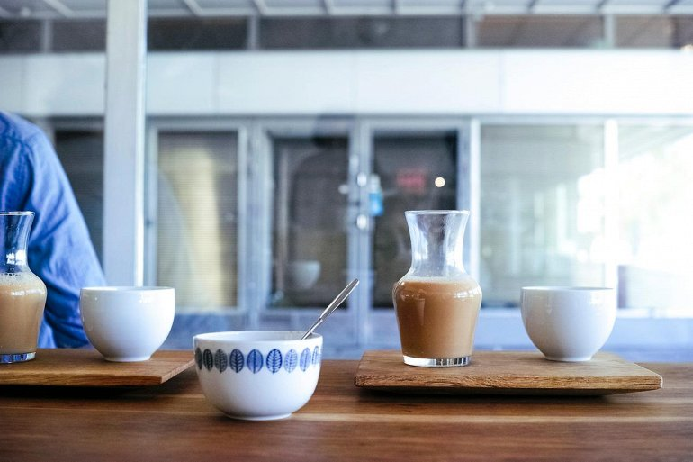
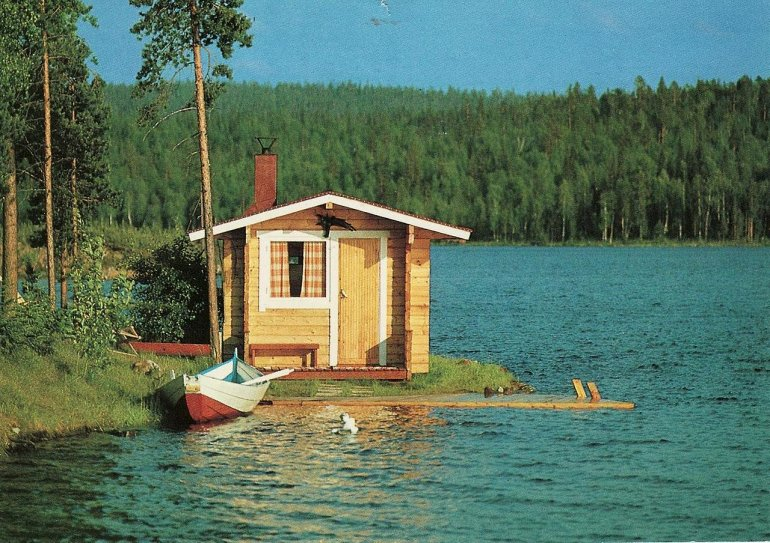

# 5 interesting facts about Finland

Have you ever thought about traveling to Finland? If such thoughts have not visited you, then you should definitely find out how exciting this country is. In Finland, there is much more than just cold weather and dark winters! In addition to the natural beauty of nature, Finland has many unique attractions, original culture and interesting way of life. 

## Finns love sauna

Almost every house in Finland has a sauna. There are a total of 2.2 million saunas (according to the Encyclopedia of Religion and Nature, published in 2005) for a population of approximately 5.4 million people. This is an incredibly important part of Finnish culture for many centuries. Finns in sauna to relax and feel healthier. There is also a social component, as a reason to meet friends, or family. While the Italians gather and eat pasta for dinner, and the British drink their afternoon tea, the Finns invite each other to the sauna evening. Many Finns prefer to go to the sauna naked, so do not be surprised to find some nudity here. Hard northern people willingly jump into snow drifts right after leaving a warm room. Sometimes, instead of snow drifts is used artificial pond specially created near the sauna.

## Drunkenness is not a stereotype.

When going to a party or bar, Finns like a good drink. And this is not a stereotype at all - Finns really drink a lot. Nevertheless, they are not in the first place in Europe in terms of alcohol consumption, second to Russia, Ukraine, Hungary, and Portugal. But the amount of alcohol that the average Finn consumes per year is much higher than the international average.

## Love of coffee

Despite the statistics, Finns still prefer coffee to alcohol. While coffee is usually little associated with Finland, Finns like this drink as much as Italians, and maybe even more. According to the rating of the largest coffee consumers in the world, Finland is the country with the largest consumption of coffee and coffee drinks in the world.

## Dark winter and sunny summer

The climate in Finland is at least quite strange. During the winter, there is very little sunlight, especially in the northernmost part of the country. In summer, on the other hand, the sunlight never stops. In the northernmost part of the country, the sun shines for 60 consecutive days. This phenomenon is known as the midnight sun and occurs in areas north of the Arctic Circle, and a quarter of Finland's land lies far to the north.

## Finns listen to the metal.

Among the musical preferences of the Finns at the top of the list is metal. It may be because of the gloomy weather or mysterious nature, but regardless of the reason - Finns like to play and listen to metal music. Some of the most famous representatives of the world genre come from Finland, including bands Nightwish, Stratovarius and Children of Bodom. Inspired by the world-famous superstars, the Finns continue to create new bands, many of which also become famous. There are four and a half metal bands per 100,000 Finns, which makes them the European champion in this direction. Only Swedes can compete with Finns in this respect.

